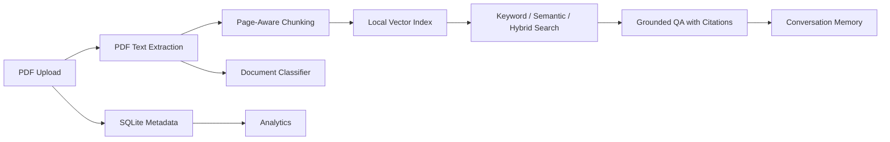

# AI Research & Knowledge Assistant

Production-oriented FastAPI backend for PDF ingestion, semantic retrieval, grounded RAG-style question answering, document analysis, TensorFlow-backed classification, conversation memory, and knowledge-base analytics.

## Architecture



## Technology Stack

- FastAPI and Uvicorn for REST APIs and Swagger documentation.
- SQLite for document metadata, conversation history, and query analytics.
- PyPDF2 for PDF extraction.
- scikit-learn TF-IDF vectors for local semantic-style retrieval and keyword/hybrid scoring.
- OpenAI API, when `OPENAI_API_KEY` is configured, for generated answers, summaries, and comparisons.
- TensorFlow/Keras training script plus runtime classifier integration. If TensorFlow/model artifacts are unavailable, the API uses a transparent heuristic fallback.

## Setup

```bash
python -m venv .venv
.venv\Scripts\activate
pip install -r requirements.txt
copy .env.example .env
uvicorn app.main:app --reload --host 0.0.0.0 --port 8000
```

Open Swagger UI at `http://localhost:8000/docs`.

## Environment Variables

| Variable | Purpose |
| --- | --- |
| `OPENAI_API_KEY` | Enables LLM-generated QA, summaries, and comparisons. |
| `OPENAI_MODEL` | Chat model name. Defaults to `gpt-4o-mini`. |
| `DATABASE_FILE` | SQLite database path. Defaults to `data.db`. |
| `INDEX_DIR` | Local vector/chunk index directory. Defaults to `./index`. |
| `STORAGE_DIR` | Uploaded PDF storage directory. Defaults to `./storage`. |
| `TF_CLASSIFIER_PATH` | Saved TensorFlow classifier path. Defaults to `./models/classifier.h5`. |

## API Overview

### Documents

- `POST /documents/upload` uploads one PDF and starts processing.
- `GET /documents/` lists uploaded documents and metadata.
- `DELETE /documents/{doc_id}` deletes metadata, stored PDF, and index files.
- `POST /documents/{doc_id}/reprocess` re-runs extraction, chunking, indexing, and classification.

### Search and QA

- `GET /search/semantic?q=...&k=5` quick semantic search.
- `POST /search/` supports `keyword`, `semantic`, and `hybrid` modes.
- `POST /search/qa` answers from retrieved context with citations, optional `session_id`, and returned context.
- `GET /search/qa?q=...` convenience QA endpoint.

Example QA body:

```json
{
  "query": "What limitations does the paper mention?",
  "k": 5,
  "mode": "hybrid",
  "session_id": "demo-session",
  "doc_ids": ["optional-doc-id"]
}
```

### Analysis

- `GET /analysis/summarize/{doc_id}?type=executive` returns executive, technical, bullet, and takeaway summaries.
- `POST /analysis/compare?focus=methodologies` compares two or more document IDs.
- `GET /analysis/classify/{doc_id}` re-runs document category prediction.

### Memory

- `POST /memory/append` manually appends a session message.
- `GET /memory/get/{session_id}` reads conversation history.
- `POST /memory/clear/{session_id}` clears a session.

### Analytics

- `GET /analytics/stats` returns document counts, chunk totals, embedding totals, category distribution, total queries/questions, and most referenced documents.

## Design Decisions

- Chunking is page-aware with about 1000 characters per chunk and 150 characters of overlap. This keeps citations tied to PDF pages while preserving context across chunk boundaries.
- Retrieval supports keyword, semantic, and hybrid modes. Keyword is useful for exact names and IDs, semantic is better for conceptual queries, and hybrid balances both.
- RAG responses are grounded in retrieved chunks. If no chunks are found, the assistant returns that the answer cannot be determined from the uploaded documents.
- The project remains runnable without paid APIs. OpenAI integration enhances answer generation, but local extractive fallbacks keep endpoints testable.
- TensorFlow is integrated through `app/ml/train_classifier.py` and `app/classifier.py`; heuristic fallback is explicit when TensorFlow or a trained model is unavailable.

## Training the Classifier

```bash
python app/ml/train_classifier.py
```

The script trains a Keras text classifier and writes the model to `TF_CLASSIFIER_PATH`. Uploaded documents are automatically classified during processing.

## Limitations

- The local vector index is file-backed and intended for coursework/prototype scale. For large production deployments, replace it with FAISS, Chroma, Qdrant, or another managed vector database.
- PDF extraction quality depends on embedded text. Scanned documents need OCR, which is not included.
- The bundled classifier trainer is a demo pipeline. A domain-specific labeled dataset will improve category quality.

## Verification

Run a quick syntax and API smoke test:

```bash
python -m compileall app
python -c "from fastapi.testclient import TestClient; from app.main import app; c=TestClient(app); print(c.get('/').json()); print(c.get('/analytics/stats').json())"
```
